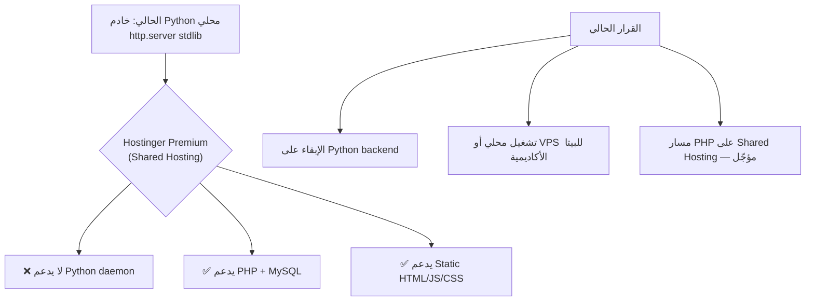

# تقييم المشروع + خطة الإطلاق الأولي على Hostinger Premium

## الغرض من الإطلاق
> إطلاق أولي (Internal/Beta) لإضافة مختصين أكاديميين لتصفية البيانات الحالية وترتيبها — **وليس إطلاقاً عاماً للجمهور**.

---

## 1. تقييم الوضع الحالي

### ✅ نقاط القوة (ما هو جاهز وممتاز)

| المكوّن | التقييم | ملاحظات |
|---------|---------|---------|
| **البيانات النباتية** | ⭐⭐⭐⭐⭐ | 152 صنفاً مصنفاً بدقة، 51 عائلة، 7 مناطق نباتية |
| **المخطط (Schema)** | ⭐⭐⭐⭐⭐ | نظام `plant_taxon.schema.json` مُحكم ومرن |
| **أدوات الإدارة (CLI)** | ⭐⭐⭐⭐⭐ | `FloraManager` + `manage_flora.py` شاملة ومتينة |
| **نظام التصنيفات المشتقة** | ⭐⭐⭐⭐⭐ | مزامنة تلقائية: habit/family/category/nativity |
| **التخزين (JSON + auth files)** | ⭐⭐⭐⭐ | Master JSON + `data/auth/*` للجلسات/الطلبات (بدون SQLite حالياً) |
| **REST API (Python)** | ⭐⭐⭐⭐ | شاملة: CRUD + بحث + auth + مراجعة طلبات |
| **الواجهة الأمامية (UI)** | ⭐⭐⭐⭐⭐ | تصميم داكن، RTL، جدول/بطاقات/شبكة — أخطاء المرحلة 1 مُعالَجة |
| **نظام الأدوار (RBAC)** | ⭐⭐⭐⭐ | guest / user / admin / owner + أكواد ترقية |
| **التوثيق (README)** | ⭐⭐⭐⭐⭐ | شامل، ثنائي اللغة، مع citation |

**التقييم العام: 8.5/10** — مشروع ناضج معمارياً؛ الواجهة جاهزة للبيتا محلياً/على VPS. مسار Hostinger shared يحتاج PHP لاحقاً (مؤجّل).

---

### 🐛 أخطاء برمجية (Bugs) — حالة المرحلة 1

> تم التحقق من الشجرة الحالية (2026-07-23). أغلب بنود المرحلة 1 كانت مُصلحة مسبقاً؛ أُضيفت لمسات تنسيق متبقية.

| # | المشكلة | الحالة |
|---|---------|--------|
| 1 | مودال `.active` vs `.open` | ✅ موحّد على `.open` في JS + CSS |
| 2 | Toast class names | ✅ `toast success/error` + أُضيف `.toast.info` وألوان خلفية |
| 3 | إحصاءات الهيدر `#statTotal`… | ✅ موجودة في `index.html` + تحديث آمن null-safe |
| 4 | `.taxa-table` vs `.data-table` | ✅ يستخدم `data-table` |
| 5 | شارات badges / zone / id / family | ✅ أنماط `badge-*` + `zone-pill` / `id-badge` / `family-tag` |
| 6 | `presence_in_iraq: "موجو"` | ✅ `"موجود"` |
| 7 | حقول النموذج ناقصة | ✅ zones / presence / local status / IUCN / notes كاملة |

---

## 2. ما ينقص للإطلاق على Hostinger Premium

### البنية الحالية vs المطلوب

> [!IMPORTANT]
> **Hostinger Premium** (Shared) تدعم **PHP + MySQL** وليس Python daemon.  
> **قرار الجلسة (2026-07-23):** **لا تحويل إلى PHP الآن** — يبقى `tools/web_server.py` + `flora_lib`.  
> للبيتا مع المختصين: تشغيل محلي أو **VPS** (أو أي بيئة تدعم Python 3.10+).

### المطلوب تقنياً (عند اختيار PHP لاحقاً)

#### المسار أ — PHP Backend (مؤجّل) ⏸️

| المكوّن | الوصف | الجهد |
|---------|-------|-------|
| **PHP API Layer** | ترجمة REST API الحالية إلى PHP | متوسط |
| **MySQL Migration** | ترحيل JSON/auth → MySQL | متوسط |
| **Frontend Adaptation** | تعديل `api.js` لمسار PHP | منخفض |
| **Google OAuth (Production)** | OAuth Client للدومين الحقيقي | منخفض |
| **HTTPS + Domain** | ربط الدومين + SSL | منخفض |
| **htaccess + Routing** | URL rewriting للـ API | منخفض |

#### المسار ب — Python على VPS (مُوصى للبيتا الآن) ✅

| المكوّن | الوصف | الجهد |
|---------|-------|-------|
| **VPS / Python host** | تشغيل `web_server.py` أو reverse-proxy (nginx) | منخفض–متوسط |
| **Google OAuth إنتاج** | Redirect URI للدومين الحقيقي | منخفض |
| **تعطيل dev login** | `"allow_dev_login": false` في الإنتاج | منخفض |
| **HTTPS** | شهادة Let's Encrypt / لوحة الاستضافة | منخفض |

---

## 3. خطة التنفيذ

### المرحلة 1: إصلاح الأخطاء البرمجية — ✅ مكتملة (2026-07-23)
- [x] إصلاح Bug 1: توحيد Modal class (`.open`)
- [x] إصلاح Bug 2: توحيد Toast + `.toast.info`
- [x] إصلاح Bug 3: عناصر الإحصاءات + null-safe
- [x] إصلاح Bug 4: جدول `data-table`
- [x] إصلاح Bug 5: CSS للشارات (id / family / zone / native)
- [x] إصلاح Bug 6: `"موجود"`
- [x] إصلاح Bug 7: حقول نموذج الإضافة/التعديل كاملة

### المرحلة 2: إنشاء PHP Backend — ⏸️ مؤجّلة (قرار: الإبقاء على Python)
- [ ] إنشاء `api/index.php` — router رئيسي
- [ ] إنشاء `api/config.php` — إعدادات قاعدة البيانات
- [ ] ترحيل endpoints المطلوبة للمختصين
- [ ] MySQL schema + سكربت ترحيل من JSON

### المرحلة 3: تهيئة الواجهة للاستضافة — ⏸️ جزئياً (بعد قرار الاستضافة)
- [ ] تعديل `api.js` إن وُجد backend مختلف
- [ ] إعداد Google OAuth Client ID للدومين الحقيقي
- [ ] تقييد/إزالة `allow_dev_login` في الإنتاج

### المرحلة 4: الرفع والإعداد — ⏸️ معلّقة
- [ ] اختيار بيئة (VPS Python **أو** Shared PHP لاحقاً)
- [ ] رفع الملفات + اختبار endpoints
- [ ] ربط الدومين + SSL

---

## 4. أسئلة مفتوحة

1. **هل لديك دومين مُعدّ بالفعل؟** أم تحتاج إرشادات لإعداده على Hostinger؟
2. **Google OAuth**: حقيقي للتسجيل، أم dev-login مؤقتاً للمختصين؟
3. **مسار الاستضافة (محدَّث):**
   - ~~المسار أ (PHP)~~ — مؤجّل
   - **المسار ب (Python / VPS أو محلي)** — الحالي
4. ~~هل نبدأ بإصلاح الأخطاء؟~~ — ✅ تم
5. **بيانات JSON:** هل يكتفي المختصون بالواجهة، أم يحتاجون تحميل/رفع JSON أيضاً؟

---

## 5. ملخص سريع

| البند | الحالة |
|-------|--------|
| البيانات والمخطط | ✅ جاهز |
| أدوات الإدارة (CLI) | ✅ جاهز |
| الواجهة الأمامية | ✅ جاهزة بعد المرحلة 1 |
| REST API (Python) | ✅ جاهز محلياً |
| توافق Hostinger Shared | ⏸️ يحتاج PHP لاحقاً (مؤجّل) |
| توافق VPS / محلي Python | ✅ جاهز |
| Google OAuth | ⚠️ يحتاج إعداد إنتاجي عند الرفع |
| HTTPS/Domain | ❌ يحتاج إعداد عند الرفع |
| جاهزية المختصين (بيتا) | ✅ محلياً / على أي استضافة Python |

> **القرار الحالي:** بيـتا أكاديمية عبر **Python** (محلي أو VPS). مسار PHP لـ Hostinger Premium Shared يُنفَّذ لاحقاً عند الطلب.
